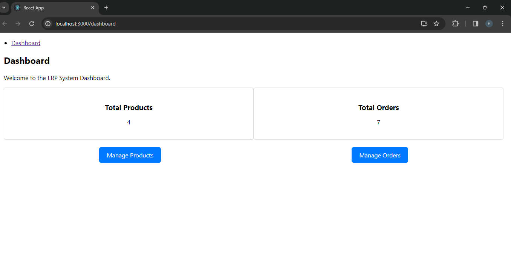

                        ERP System with React
# Overview:

This project is an ERP (Enterprise Resource Planning) system designed to manage basic business operations efficiently. It provides a simplified interface for managing products and orders, as well as a calendar view for tracking orders based on their expected delivery dates.

## Features:

•	Dashboard: Provides an overview of key metrics and features.
•	Products Management: Allows for the management of product listings.
•	Orders Management: Facilitates viewing and handling orders.
•	Orders Calendar View: A calendar interface displaying orders based on their expected delivery dates.
Running the Application:
In the project directory, you can run:

# npm install

Install the dependencies

# npm start

Runs the app in the development mode.
Open http://localhost:3000 to view it in the browser.
The page will reload if you make edits.
You will also see any lint errors in the console.
# npm test

Launches the test runner in the interactive watch mode.
See the section about running tests for more information.

# npm run build

Builds the app for production to the build folder.
It correctly bundles React in production mode and optimizes the build for the best performance.
The build is minified and the filenames include the hashes.
Your app is ready to be deployed!
See the section about deployment for more information.

# npm run eject

Note: this is a one-way operation. Once you eject, you can’t go back!
If you aren’t satisfied with the build tool and configuration choices, you can eject at any time. This command will remove the single build dependency from your project.
Instead, it will copy all the configuration files and the transitive dependencies (webpack, Babel, ESLint, etc) right into your project so you have full control over them. All of the commands except eject will still work, but they will point to the copied scripts so you can tweak them. At this point you’re on your own.
You don’t have to ever use eject. The curated feature set is suitable for small and middle deployments, and you shouldn’t feel obligated to use this feature. However we understand that this tool wouldn’t be useful if you couldn’t customize it when you are ready for it.

# ##Cloning the Project Repository and Navigating to the Directory:

1.clone the project repository from GitHub
git clone http://github.com/obiliharshitha23/erp_entnt.git
2.Navigate to the project directory:
cd erp_entnt

# Instructions for Setting Up And Interacting With The Website:

## 	Website Setup:

o	Open your web browser and navigate to the website's URL.
o	Once open in, you'll land on the homepage with dashboard link.

## 	Navigating the Website:

o	Use the navigation links provided to explore different sections of the website, such as Products, Orders, or Dashboard.
o	Click on each section to view more details or perform specific actions.

## 	Dashboard:

o	The dashboard displays key metrics or features, such as total number of products, orders, or any other relevant information.
o	It may include quick navigation links to access other parts of the website easily.

## 	Products Management:

o	Navigate to the Products section to manage products.
o	You can view a list of products with details like name, category, price, and stock quantity.
o	Use the provided functionalities to add, edit, or delete products as needed.

## 	Orders Management:

o	Visit the Orders section to manage orders.
o	You'll see a list of orders with details like order ID, customer name, order date, and status.
o	Interact with orders by add, updating order or deleting orders.
o	navigating link provide Orders Calendar View

## 	Orders Calendar View:

o	If available, explore the calendar view to see orders scheduled for delivery dates.
o	 Click on a date to view all orders due for delivery on that day.

# Project Images:

## Step 1: Home Screen
•	After compiling successfully, the home screen page will be open.
•	In the home screen page, Dashboard will be appeared.
•	Then Click on the Dashboard shown by arrow mark

# Step 2 :Dashboard
•	Then the dashboard page will be open.
•	In the dashboard,it can display total number of Products and total number of orders.
•	After that,click on manage products .It will be directly navigate to the product management page.
•	If any Products or orders are added,it will automatically reload in the total number of products and orders in dashboard page.

# Step 3 : Product Management

•	In the product management page, we have details like product names, category, price, stock quantity, actions like edit, delete, add.

•	We can add products by clicking Add Product button
•	After adding products, the total number of products available in the Product management will be automatically reloaded and displayed in the dashboard page.

•	Here below, it shows the added Products with details like Product name –Ramayanam,category-books,price-70,Stock Quantity-100

•	We can edit the products by clicking Edit button

•	After editing the product, click on Save button

•	Below, it shows the edited version of newly added Products where the Ramayanam book price is increased from 70 to 350 and stock quantity is changed from 100 to 200

•	We can delete the Product by just Clicking Delete button.

•	Here below, it shows the newly added product which is Ramayanam book can be deleted by clicking delete button.

# Step 3: Order Management:

•	Just click on dashboard and then dashboard page will be open.
•	In that dashboard page, click on Manage Orders.
•	After Clicking Manage Orders, It will directly navigate to the Order Management Page.

•	Order Management Page will be open.
•	In the Order management page, we have details like Order ID, Customer Name, Order date, status, delivery date.

•	We can  add order by clicking Add Order button

.   After adding the order,click on Save button

•	We can update the order details by clicking Update  button

•	We can delete the order by clicking the Delete button

# Step 4:Order Calender View

•	Click on Order Calender View
•	Order calender view is for at which date the particular Order has to be delivered.

•	Then the order calendar page will be open.

•	By clicking the date in the calendar, we can see the orders that has to be delivered on that date along with day.
•	Here,we can see that on March 18,the order has to deliver for the customer-Penchal Reddy with Order ID-4 and also for the customer-Apurupa with Order ID-6.
•	we can see the status of the particular customer order .whether the order is pending/ordered/shipping/cancel/return/delivered.

•	Here ,we can the delivery orders on March 19

Here ,we can the delivery orders on March 21

Here ,we can the delivery orders on March 22

•	If you want to go back to order management click on Order Management then Oder management page will be opened.
